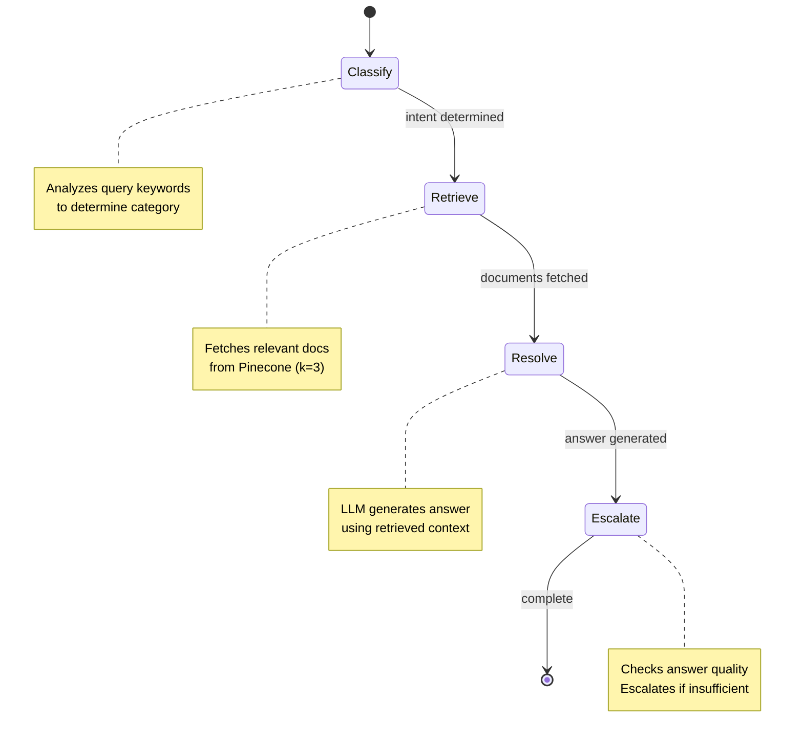

# University Support System - Project Specification

> **Version:** 1.0.0  
> **Last Updated:** December 13, 2025  
> **Status:** Active Development

---

## Table of Contents

1. [Executive Summary](#executive-summary)
2. [Project Overview](#project-overview)
3. [Architecture](#architecture)
4. [Technology Stack](#technology-stack)
5. [Core Components](#core-components)
6. [Data Flow](#data-flow)
7. [Knowledge Base](#knowledge-base)
8. [Configuration](#configuration)
9. [Deployment Guide](#deployment-guide)
10. [Development Guidelines](#development-guidelines)
11. [Future Enhancements](#future-enhancements)
12. [Troubleshooting](#troubleshooting)

---

## Executive Summary

The **University Support System** is an AI-powered conversational assistant designed to answer queries related to university admissions, programs, fees, scholarships, and general information. It leverages **Retrieval-Augmented Generation (RAG)** architecture combining vector similarity search with Large Language Model (LLM) capabilities to provide accurate, context-aware responses.

### Key Highlights

- 🤖 **LLM**: Groq's Llama 3.3 70B Versatile model
- 🔍 **Vector Database**: Pinecone (serverless)
- 📚 **Embeddings**: HuggingFace `sentence-transformers/all-mpnet-base-v2`
- 🔗 **Orchestration**: LangChain + LangGraph
- 🖥️ **UI**: Streamlit chat interface

---

## Project Overview

### Purpose

This system serves as a **24/7 virtual university support assistant** capable of:

1. Answering student queries about admissions (undergraduate & graduate)
2. Providing program information (Engineering, CS, Business, Natural Sciences)
3. Explaining tuition fees and financial aid options
4. Describing scholarship opportunities
5. Providing general university overview and history

### Target Users

| User Type            | Use Case                                |
| -------------------- | --------------------------------------- |
| Prospective Students | Admissions info, program details, fees  |
| Current Students     | General queries, program specifics      |
| Parents/Guardians    | Fee structures, scholarship information |
| University Staff     | Reduce repetitive query workload        |
| AI/ML Engineers      | Extend/customize the system             |

### Problem Statement

University support offices often face:

- High volume of repetitive queries
- Limited availability (office hours only)
- Inconsistent information delivery
- Long response times during peak periods

This system addresses these challenges by providing instant, accurate, and consistent responses around the clock.

---

## Architecture

### High-Level Architecture

```
┌─────────────────────────────────────────────────────────────────────────────┐
│                              USER INTERFACE                                   │
│                            (Streamlit Chat UI)                               │
│                               main.py                                         │
└─────────────────────────────────────────────────────────────────────────────┘
                                      │
                                      ▼
┌─────────────────────────────────────────────────────────────────────────────┐
│                           LANGGRAPH WORKFLOW                                  │
│                            langGraphFun.py                                    │
│  ┌───────────┐    ┌───────────┐    ┌───────────┐    ┌───────────┐          │
│  │ Classify  │───▶│ Retrieve  │───▶│  Resolve  │───▶│ Escalate  │───▶ END   │
│  │  Query    │    │ Knowledge │    │  Answer   │    │ if Needed │          │
│  └───────────┘    └───────────┘    └───────────┘    └───────────┘          │
└─────────────────────────────────────────────────────────────────────────────┘
                                      │
                    ┌─────────────────┴─────────────────┐
                    ▼                                   ▼
┌───────────────────────────────┐    ┌───────────────────────────────────────┐
│       LANGCHAIN RAG PIPELINE   │    │              LLM SERVICE              │
│        langChainFun.py         │    │                                       │
│                               │    │   ┌───────────────────────────────┐   │
│  ┌─────────────────────────┐  │    │   │        Groq API               │   │
│  │   Document Loaders      │  │    │   │   (Llama 3.3 70B Versatile)   │   │
│  │   Text Splitters        │  │    │   └───────────────────────────────┘   │
│  │   HuggingFace Embeddings│  │    │                                       │
│  │   Pinecone Vector Store │  │    └───────────────────────────────────────┘
│  │   Retriever             │  │
│  └─────────────────────────┘  │
└───────────────────────────────┘
                │
                ▼
┌───────────────────────────────┐
│     PINECONE VECTOR DATABASE   │
│   Index: university-support    │
│   Dimension: 768               │
│   Metric: Cosine Similarity    │
└───────────────────────────────┘
                │
                ▼
┌───────────────────────────────┐
│       KNOWLEDGE BASE           │
│       ./dataset/               │
│                               │
│  • university_overview.txt    │
│  • admissions_undergraduate   │
│  • admissions_graduate        │
│  • programs_engineering_cs    │
│  • programs_business_natural  │
└───────────────────────────────┘
```

### Workflow State Machine



---

## Technology Stack

### Core Technologies

| Layer               | Technology  | Version | Purpose                            |
| ------------------- | ----------- | ------- | ---------------------------------- |
| **Runtime**         | Python      | ≥3.12   | Core language                      |
| **Package Manager** | uv          | Latest  | Fast dependency management         |
| **LLM**             | Groq API    | -       | LLM inference (Llama 3.3 70B)      |
| **Vector DB**       | Pinecone    | ≥7.3.0  | Vector similarity search           |
| **Embeddings**      | HuggingFace | ≥1.1.0  | sentence-transformers              |
| **Orchestration**   | LangChain   | ≥1.2.0  | RAG pipeline                       |
| **Workflow**        | LangGraph   | -       | State machine for query processing |
| **UI**              | Streamlit   | ≥1.52.1 | Chat interface                     |

### Dependencies

```toml
[project]
name = "university-support-system"
version = "0.1.0"
requires-python = ">=3.12"

dependencies = [
    "dotenv>=0.9.9",              # Environment variable management
    "langchain-community>=0.4.1",  # Community integrations
    "langchain-core>=1.2.0",       # Core LangChain functionality
    "langchain-groq>=1.1.0",       # Groq LLM integration
    "langchain-huggingface>=1.1.0", # HuggingFace embeddings
    "langchain-pinecone>=0.2.13",  # Pinecone vector store
    "pinecone>=7.3.0",             # Pinecone client
    "streamlit>=1.52.1",           # Web UI framework
]
```

---

## Core Components

### 1. LangChain RAG Pipeline (`langChainFun.py`)

This file establishes the foundational RAG infrastructure.

#### Key Exports

| Export      | Type                   | Description                  |
| ----------- | ---------------------- | ---------------------------- |
| `llm`       | `ChatGroq`             | Configured LLM instance      |
| `retriever` | `VectorStoreRetriever` | Document retrieval interface |

#### LLM Configuration

```python
llm = ChatGroq(
    model="llama-3.3-70b-versatile",
    temperature=0,      # Deterministic outputs
    max_tokens=None,    # No limit
    timeout=None,       # No timeout
    max_retries=2,      # Retry on failure
)
```

#### Document Processing Pipeline

1. **Load**: TextLoader reads all `.txt` files from `./dataset/`
2. **Chunk**: RecursiveCharacterTextSplitter (500 chars, 50 overlap)
3. **Embed**: HuggingFace `all-mpnet-base-v2` (768 dimensions)
4. **Store**: Pinecone serverless index (AWS us-east-1)

#### Retriever Configuration

```python
retriever = vector_store.as_retriever(
    search_type="similarity_score_threshold",
    search_kwargs={
        "k": 3,                    # Return top 3 documents
        "score_threshold": 0.5    # Minimum similarity score
    },
)
```

---

### 2. LangGraph Workflow (`langGraphFun.py`)

Implements a stateful workflow for query processing.

#### State Definition

```python
@dataclass
class State:
    query: str                           # User's input query
    intent: Optional[str] = None         # Classified intent category
    docs: List = field(default_factory=list)  # Retrieved documents
    answer: Optional[str] = None         # Generated answer
```

#### Workflow Nodes

| Node         | Function               | Input         | Output               |
| ------------ | ---------------------- | ------------- | -------------------- |
| **classify** | `classify_query()`     | query         | intent               |
| **retrieve** | `retrieve_knowledge()` | query, intent | docs                 |
| **resolve**  | `resolve_answer()`     | query, docs   | answer               |
| **escalate** | `escalate_if_needed()` | answer        | answer or "ESCALATE" |

#### Intent Classification Logic

| Keywords                                             | Classified Intent  |
| ---------------------------------------------------- | ------------------ |
| admission, apply, enroll, entrance, scholarship      | `admissions`       |
| undergraduate, bachelor, bba, bs                     | `undergraduate`    |
| graduate, master, mba, ms, phd                       | `graduate`         |
| engineering, IT, CS, SE, computer science            | `engineering_cs`   |
| business, economics, natural sciences, math, physics | `business_natural` |
| (default)                                            | `general`          |

#### Escalation Criteria

The system escalates to human support when:

- Answer contains "i don't know"
- Answer length is less than 40 characters

---

### 3. Streamlit UI (`main.py`)

A modern chat interface with the following features:

#### UI Components

| Feature             | Description                                |
| ------------------- | ------------------------------------------ |
| **Header**          | Gradient banner with title and description |
| **Chat Container**  | Scrollable message history                 |
| **Message Bubbles** | Styled user/assistant messages             |
| **Thinking State**  | "Thinking…" indicator during processing    |
| **Chat Input**      | Bottom-fixed input field                   |

#### Message Types

| Role        | Style                 | Purpose              |
| ----------- | --------------------- | -------------------- |
| `user`      | Light blue (#dbeafe)  | User queries         |
| `assistant` | Soft purple (#f3e8ff) | AI responses         |
| `thinking`  | Light gray (#f1f5f9)  | Processing indicator |

#### Session State

```python
st.session_state.messages = [
    {"role": "user", "content": "..."},
    {"role": "assistant", "content": "..."},
    {"role": "thinking", "content": "Thinking…"},
]
```

---

## Data Flow

### Query Processing Sequence

```
1. User enters query in Streamlit chat input
                    │
                    ▼
2. Query added to session state with "user" role
   "thinking" message displayed
                    │
                    ▼
3. LangGraph app.invoke({"query": query}) called
                    │
        ┌───────────┴───────────┐
        ▼                       │
4. CLASSIFY NODE                │
   - Analyze query keywords     │
   - Determine intent category  │
        │                       │
        ▼                       │
5. RETRIEVE NODE                │
   - Query Pinecone with intent │
   - Fetch top 3 similar docs   │
        │                       │
        ▼                       │
6. RESOLVE NODE                 │
   - Build context from docs    │
   - Create system prompt       │
   - Call Groq LLM              │
   - Generate answer            │
        │                       │
        ▼                       │
7. ESCALATE NODE                │
   - Check answer quality       │
   - Return "ESCALATE" if poor  │
        │                       │
        └───────────┬───────────┘
                    │
                    ▼
8. Response displayed in UI
   - Normal answer: Success message
   - ESCALATE: Warning to contact admin
```

---

## Knowledge Base

### Dataset Structure

```
./dataset/
├── university_overview.txt         # General university info
├── admissions_undergraduate.txt    # UG admission details
├── admissions_graduate.txt         # Graduate admission details
├── programs_engineering_cs.txt     # Engineering & CS programs
└── programs_business_natural_sciences.txt  # Business & Sciences
```

### Document Categories

#### 1. University Overview

- Name, Location (Main Campus, North Campus)
- Vision and Mission statements
- University type, statistics (students, faculty)
- Brief history

#### 2. Undergraduate Admissions

- Eligibility requirements
- Required documents
- Tuition fees by program
- Application process and deadlines
- Scholarship opportunities

#### 3. Graduate Admissions

- Master's and PhD eligibility
- Application requirements
- Tuition fees structure
- Financial support (RA, TA, Scholarships)
- Application deadlines

#### 4. Programs - Engineering & CS

- Available degrees (BS/MS/PhD)
- Programs: EE, ME, CE, CS, SE
- Tuition by level
- Credit requirements

#### 5. Programs - Business & Natural Sciences

- Business Administration (BBA, MBA, PhD)
- Economics (BS, MS, PhD)
- Mathematics & Physics
- Tuition and specializations

---

## Configuration

### Environment Variables

Create a `.env` file in the project root:

```env
# Required API Keys
GROQ_API_KEY=gsk_xxxxxxxxxxxxxxxxxxxxxxxxxxxx
PINECONE_API_KEY=xxxxxxxx-xxxx-xxxx-xxxx-xxxxxxxxxxxx
```

### Pinecone Index Configuration

| Parameter  | Value                       |
| ---------- | --------------------------- |
| Index Name | `university-support-system` |
| Dimension  | 768                         |
| Metric     | Cosine                      |
| Cloud      | AWS                         |
| Region     | us-east-1                   |
| Spec       | Serverless                  |

---

## Deployment Guide

### Local Development

```bash
# 1. Clone the repository
git clone <repository-url>
cd university_support_system

# 2. Install uv (if not installed)
curl -LsSf https://astral.sh/uv/install.sh | sh

# 3. Create virtual environment and install dependencies
uv sync

# 4. Configure environment variables
cp .env.example .env
# Edit .env with your API keys

# 5. Run the application
uv run streamlit run main.py
```

### First Run Behavior

On first run, the system will:

1. Download HuggingFace embedding model (~420MB)
2. Create Pinecone index (if not exists)
3. Embed and upload all documents to Pinecone
4. Launch Streamlit interface

### Production Deployment

> [!IMPORTANT]
> For production, consider:
>
> - Containerizing with Docker
> - Using managed Pinecone (not starter tier)
> - Rate limiting for Groq API
> - Adding authentication layer
> - Monitoring and logging

---

## Development Guidelines

### Code Style

- Follow PEP 8 conventions
- Use type hints for function parameters
- Document complex logic with inline comments
- Keep functions focused and small

### Adding New Knowledge

1. Create new `.txt` file in `./dataset/`
2. Delete existing Pinecone index (or use new name)
3. Restart application to re-index

### Extending Intent Classification

Modify `classify_query()` in `langGraphFun.py`:

```python
def classify_query(state: State) -> State:
    q = state.query.lower()

    # Add new category
    if any(x in q for x in ["campus", "facility", "library", "hostel"]):
        state.intent = "campus_facilities"
    # ... existing logic

    return state
```

### Adding New Workflow Nodes

```python
# 1. Define the node function
def new_node(state: State) -> State:
    # Process state
    return state

# 2. Add to graph
graph.add_node("new_node", new_node)

# 3. Add edges
graph.add_edge("previous_node", "new_node")
graph.add_edge("new_node", "next_node")
```

---

## Future Enhancements

### Planned Features

| Priority  | Feature                | Description                              |
| --------- | ---------------------- | ---------------------------------------- |
| 🔴 High   | Multi-language Support | Add support for Urdu and other languages |
| 🔴 High   | Conversation Memory    | Maintain context across multiple turns   |
| 🟡 Medium | Feedback Loop          | Allow users to rate responses            |
| 🟡 Medium | Analytics Dashboard    | Track query patterns and usage           |
| 🟢 Low    | Voice Interface        | Speech-to-text integration               |
| 🟢 Low    | Mobile App             | Flutter/React Native frontend            |

### Technical Improvements

- [ ] Implement caching for frequent queries
- [ ] Add async processing for better performance
- [ ] Create REST API alongside Streamlit UI
- [ ] Implement A/B testing for prompts
- [ ] Add automated knowledge base updates

---

## Troubleshooting

### Common Issues

| Issue                 | Cause                 | Solution                       |
| --------------------- | --------------------- | ------------------------------ |
| `ModuleNotFoundError` | Missing dependencies  | Run `uv sync`                  |
| Pinecone timeout      | Network/API issues    | Check API key and connectivity |
| Empty responses       | Low similarity scores | Adjust `score_threshold`       |
| Slow responses        | Model download        | Wait for first-time setup      |
| "ESCALATE" always     | Poor retrieval        | Check knowledge base content   |

### Debug Mode

Enable verbose logging:

```python
import logging
logging.basicConfig(level=logging.DEBUG)
```

### Checking Pinecone Index

```python
from pinecone import Pinecone
pc = Pinecone(api_key="your-key")
index = pc.Index("university-support-system")
print(index.describe_index_stats())
```

---

## Appendix

### API Rate Limits

| Service     | Limit                 | Recommendation            |
| ----------- | --------------------- | ------------------------- |
| Groq        | 30 req/min (free)     | Implement request queuing |
| Pinecone    | 100 req/sec (starter) | Use batch operations      |
| HuggingFace | Unlimited (local)     | N/A                       |

### Model Information

- **Llama 3.3 70B Versatile**: Meta's latest open model, 128K context
- **all-mpnet-base-v2**: 768-dim embeddings, 109M parameters

### License

This project is for educational and internal use. Ensure compliance with:

- Groq Terms of Service
- Pinecone Terms of Service
- HuggingFace Model Cards

---

> **Maintained by:** University Support System Team  
> **Contact:** [Add contact info]  
> **Repository:** [Add repository URL]
